<script type="text/javascript" src="http://cdn.mathjax.org/mathjax/latest/MathJax.js?config=default"></script>


**L1 L2 正则化的区别，为什么 L1 产生稀疏矩阵，L2 可以防止过拟合**
    
    ·L0范数是非零元素之和，求解是个NP问题，非凸；所以，凸函数的求解方法对他并不适用。
    L1L2是近似解
    ·L1正则化是指权值向量w中各个元素的绝对值之和
    ·L2正则化是指权值向量w中各个元素的平方和然后再求平方根
    过拟合实质上是模型的表示能力“太强”，也就是模型容量太大。
    通过加上正则来降低模型的容量或者表示能力，
    L1约束模型参数分布比较稀疏，L2约束参数分布均匀一点，减少系数个数。
    简单点说，l1限制了模型容量，所以可以减少过拟合;
    l2相当于认为参数服从高斯分布，l1是拉普拉斯分布。
    L1,L2范式来自于对数据的先验知识.如果你认为,你现有的数据来自于高斯分布,
    那么就应该在代价函数中加入数据先验P(x),一般由于推导和计算方便会加入对数似然,
    也就是log(P(x)),然后再去优化,这样最终的结果是,由于你的模型参数考虑了数据先验,
    模型效果当然就更好.哦对了,如果你去看看高斯分布的概率密度函数P(x),
    你会发现取对数后的log(P(x))就剩下一个平方项了,这就是L2范式的由来--高斯先验.
    同样,如果你认为你的数据是稀疏的,不妨就认为它来自某种laplace分布.
    laplace分布是尖尖的分布,服从laplace分布的数据就是稀疏的了
    (只有很小的概率有值,大部分概率值都很小或为0).
    L1和L2在求导后，分别为常数和<1的变量，L1可以使参数缩小到非正不再激活，L2减小参数的权重。

**损失函数：L1 loss, L2 loss, smooth L1 loss**

对于大多数CNN网络，我们一般是使用L2-loss而不是L1-loss，因为L2-loss的收敛速度要比L1-loss要快得多。

对于边框预测回归问题，通常也可以选择平方损失函数（L2损失），但L2范数的缺点是当存在离群点（outliers)的时候，这些点会占loss的主要组成部分。比如说真实值为1，预测10次，有一次预测值为1000，其余次的预测值为1左右，显然loss值主要由1000主宰。所以FastRCNN采用稍微缓和一点绝对损失函数（smooth L1损失），它是随着误差线性增长，而不是平方增长。

注意：smooth L1和L1-loss函数的区别在于，L1-loss在0点处导数不唯一，可能影响收敛。smooth L1的解决办法是在0点附近使用平方函数使得它更加平滑。

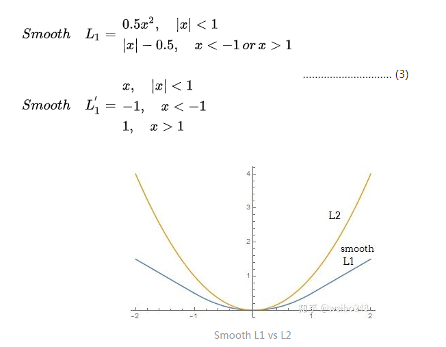


**梯度消失和梯度爆炸**

    两种情况下梯度消失经常出现，一是在深层网络中，二是采用了不合适的损失函数，比如sigmoid。梯度爆炸一般出现在深层网络和权值初始化值太大

**LR 的数学原理**
    
    逻辑回归也被称为广义线性回归模型，它与线性回归模型的形式基本上相同，都具有 ax+b，其中a和b是待求参数，其区别在于他们的因变量不同，多重线性回归直接将ax+b作为因变量，即y = ax+b，而logistic回归则通过函数S将ax+b对应到一个隐状态p，p = S(ax+b)，然后根据p与1-p的大小决定因变量的值。这里的函数S就是Sigmoid函数
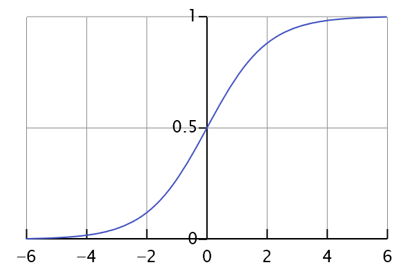

    逻辑回归一般使用交叉熵作为代价函数。
    $$L = - \frac{1}{n}\sum\limits_{i = 1}^n {[{y_i}\log ({{\hat y}_i}) + (1 - {y_i})\log (1 - {{\hat y}_i})]}$$
    梯度下降法：
    $$\begin{equation}
    \nabla L(w) = \frac{\partial L}{\partial w} = \frac{1}{N}\sum_{i=1}^{N}(h(x_i) - y_i)x_i \\
    w = w - \alpha\cdot \nabla L(w)
    \end{equation}$$

**算法评估指标 ROC曲线，AUC值**

    (1) 真阳性(True Positive，TP)：检测T，且实际T；正确肯定的匹配数目；
    (2) 假阳性(False Positive，FP)：检测T，但实际F；误报，给出的匹配是不正确的；
    (3) 真阴性(True Negative，TN)：检测F，且实际F；正确拒绝的非匹配数目；
    (4) 假阴性(False Negative，FN)：检测F，但实际T；漏报，没有正确找到的匹配的数目。
    ROC曲线：接收者操作特征曲线（receiver operating characteristic curve），是反映敏感性和特异性连续变量的综合指标，roc曲线上每个点反映着对同一信号刺激的感受性。
    横坐标：1-Specificity，伪正类率(False positive rate， FPR)，预测为正但实际为负的样本占所有负例样本的比例,FPR越大，预测正类中实际负类越多。；
    纵坐标：Sensitivity，真正类率(True positive rate， TPR)，预测为正且实际为正的样本占所有正例样本的比例,TPR越大，预测正类中实际正类越多。
    理想目标：TPR=1，FPR=0，故ROC曲线越靠拢(0,1)点，越偏离45度对角线越好，Sensitivity、Specificity越大效果越好。
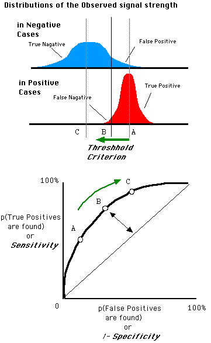
    
    AUC (Area Under Curve) 为ROC曲线下的面积，取值范围一般在0.5和1之间。使用AUC值作为评价标准是因为很多时候ROC曲线并不能清晰的说明哪个分类器的效果更好，而作为一个数值，对应AUC更大的分类器效果更好。
    AUC值是一个概率值，当你随机挑选一个正样本以及一个负样本，当前的分类算法根据计算得到的Score值将这个正样本排在负样本前面的概率就是AUC值。
    从AUC判断分类器（预测模型）优劣的标准：
    AUC = 1，是完美分类器，采用这个预测模型时，存在至少一个阈值能得出完美预测。绝大多数预测的场合，不存在完美分类器。
    0.5 < AUC < 1，优于随机猜测。这个分类器（模型）妥善设定阈值的话，能有预测价值。
    AUC = 0.5，跟随机猜测一样（例：丢铜板），模型没有预测价值。
    AUC < 0.5，比随机猜测还差；但只要总是反预测而行，就优于随机猜测。
    三种AUC值示例：


**bagging 和 boosting 区别**

    1、Bagging (bootstrap aggregating)    
    A）从原始样本集中抽取训练集。每轮从原始样本集中使用Bootstraping的方法抽取n个训练样本（在训练集中，有些样本可能被多次抽取到，而有些样本可能一次都没有被抽中）。共进行k轮抽取，得到k个训练集。（k个训练集之间是相互独立的）
    B）每次使用一个训练集得到一个模型，k个训练集共得到k个模型。（注：这里并没有具体的分类算法或回归方法，我们可以根据具体问题采用不同的分类或回归方法，如决策树、感知器等）
    C）对分类问题：将上步得到的k个模型采用投票的方式得到分类结果；对回归问题，计算上述模型的均值作为最后的结果。（所有模型的重要性相同）

    2、Boosting
    其主要思想是将弱分类器组装成一个强分类器。在PAC（概率近似正确）学习框架下，则一定可以将弱分类器组装成一个强分类器。
    关于Boosting的两个核心问题：
    1）在每一轮如何改变训练数据的权值或概率分布？
    通过提高那些在前一轮被弱分类器分错样例的权值，减小前一轮分对样例的权值，来使得分类器对误分的数据有较好的效果。
    2）通过什么方式来组合弱分类器？
    通过加法模型将弱分类器进行线性组合，比如AdaBoost通过加权多数表决的方式，即增大错误率小的分类器的权值，同时减小错误率较大的分类器的权值。
    而提升树通过拟合残差的方式逐步减小残差，将每一步生成的模型叠加得到最终模型。
    二者之间的区别
    1）样本选择上：
    Bagging：训练集是在原始集中有放回选取的，从原始集中选出的各轮训练集之间是独立的。
    Boosting：每一轮的训练集不变，只是训练集中每个样例在分类器中的权重发生变化。而权值是根据上一轮的分类结果进行调整。
    2）样例权重：
    Bagging：使用均匀取样，每个样例的权重相等
    Boosting：根据错误率不断调整样例的权值，错误率越大则权重越大。
    3）预测函数：
    Bagging：所有预测函数的权重相等。
    Boosting：每个弱分类器都有相应的权重，对于分类误差小的分类器会有更大的权重。
    4）并行计算：
    Bagging：各个预测函数可以并行生成
    Boosting：各个预测函数只能顺序生成，因为后一个模型参数需要前一轮模型的结果。
    下面是将决策树与这些算法框架进行结合所得到的新的算法：
    1）Bagging + 决策树 = 随机森林
    2）AdaBoost + 决策树 = 提升树
    3）Gradient Boosting + 决策树 = GBDT

*BN*

    BatchNorm 层对于 input batch 会统计出 mean 和 variance 用于计算 EMA。如果input batch 的 shape 为(B, C, H, W)，统计出的 mean 和 variance 的 shape 为:1 * C * 1 * 1
 

**DenseNet:**
    
    DenseNet提出了一个更激进的密集连接机制：即互相连接所有的层，
    具体来说就是每个层都会接受其前面所有层作为其额外的输入。
    且DenseNet是直接concat来自不同层的特征图，这可以实现特征重用，提升效率，
    这一特点是DenseNet与ResNet最主要的区别。
    
**过拟合**

    判断方法
    过拟合（over-fitting），机器学习模型或者是深度学习模型在训练样本中表现得过于优越，导致在验证数据集以及测试数据集中表现不佳。出现这种现象的主要原因是训练数据中存在噪音或者训练数据太少。
    过拟合问题，根本的原因则是特征维度(或参数)过多，导致拟合的函数完美的经过训练集，但是对新数据的预测结果则较差。

    常见原因
    1）建模样本选取有误，如样本数量太少，选样方法错误，样本标签错误等，导致选取的样本数据不足以代表预定的分类规则；
    2）样本噪音干扰过大，使得机器将部分噪音认为是特征从而扰乱了预设的分类规则；
    3）假设的模型无法合理存在，或者说是假设成立的条件实际并不成立；
    4）参数太多，模型复杂度过高；
    5）对于决策树模型，如果我们对于其生长没有合理的限制，其自由生长有可能使节点只包含单纯的事件数据(event)或非事件数据(no event)，使其虽然可以完美匹配（拟合）训练数据，但是无法适应其他数据集。
    6）对于神经网络模型：
    a)对样本数据可能存在分类决策面不唯一，随着学习的进行,，BP算法使权值可能收敛过于复杂的决策面；
    b)权值学习迭代次数足够多(Overtraining)，拟合了训练数据中的噪声和训练样例中没有代表性的特征。
    
    解决方法
    1）在神经网络模型中，可使用权值衰减的方法，即每次迭代过程中以某个小因子降低每个权值。
    2）提前终止迭代训练：选取合适的停止训练标准，使对机器的训练在合适的程度；
    3）保留验证数据集，对训练成果进行验证；
    4）获取额外数据进行交叉验证；
    5）正则化，即在进行目标函数或代价函数优化时，在目标函数或代价函数。如L1L2正则化，Batch Normalization正则化
    6）Bagging和Boosting  Bagging和Boosting是机器学习中的集成方法，多个模型的组合可以弱化每个模型中的异常点的影响，保留模型之间的通性，弱化单个模型的特性。
    7）增加噪声 这也是深度学习中的一种避免过拟合的方法（没办法，深度学习模型太复杂，容易过拟合），添加噪声的途径有很多，可以在输入数据上添加，增大数据的多样性，可以在权值上添加噪声，这种方法类似于L2正则化。
    8）权值共享  权值共享最常见的就是在卷积神经网络中，权值共享的目的旨在减小模型中的参数，同时还能较少计算量。在循环神经网络中也用到了权值共享
    
**ResNet**
    
    ResNet50:49个卷积层（3+4+6+3）*3+1=49    
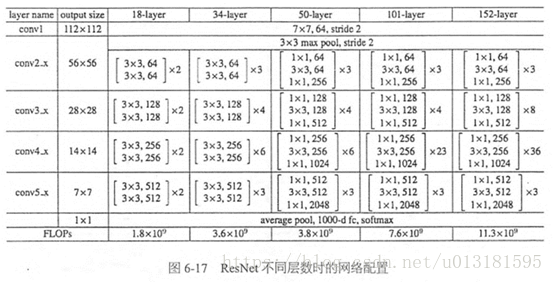

**卷积计算量**
    
    给定一个卷积层 C in * C out * H k * W k  (H k * W k 为 kernel shape), output feature  map shape 为 H * W，
    其 FLOPs 为C in * (2 * H k * W k ) * C out * H * W，参数量为 (C in * H k * W k + 1) * C out (1 乘累加 = 2 FLOPs)    
    如果通过3x3x3的卷积核那么每通道每次乘法为3x3次，加法3x3-1次（9个数加8次），通道累加Cin-1次，bias加1次
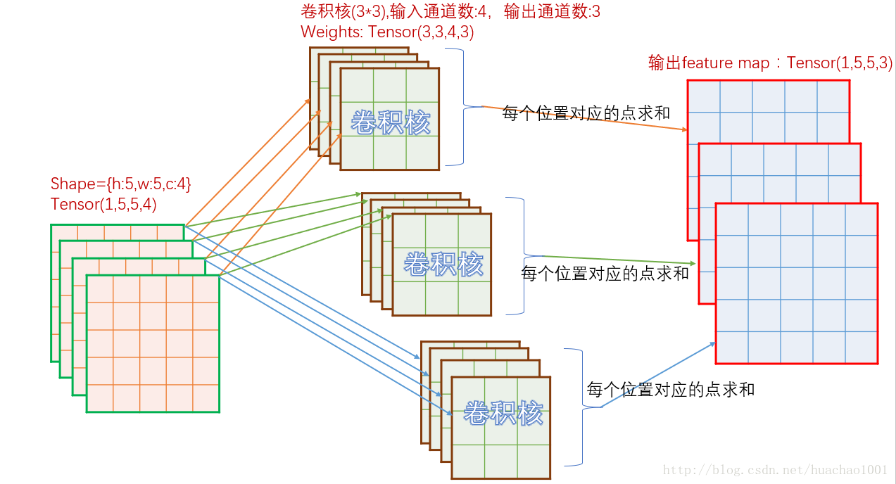

**卷积之后的尺寸**
    
    （W - F + 2P）/ S + 1
    其中，W是输入尺寸，F是卷积核大小，P是填充尺寸，S是步长

**IOU计算**
```python

def compute_iou(rec1, rec2):
    """
    计算两个矩形框的交并比。
    :param rec1: (x0,y0,x1,y1)      (x0,y0)代表矩形左上的顶点，（x1,y1）代表矩形右下的顶点。下同。
    :param rec2: (x0,y0,x1,y1)
    :return: 交并比IOU.
    """
    left_column_max  = max(rec1[0],rec2[0])
    right_column_min = min(rec1[2],rec2[2])
    up_row_max       = max(rec1[1],rec2[1])
    down_row_min     = min(rec1[3],rec2[3])
    #两矩形无相交区域的情况
    if left_column_max>=right_column_min or down_row_min<=up_row_max:
        return 0
    # 两矩形有相交区域的情况
    else:
        S1 = (rec1[2]-rec1[0])*(rec1[3]-rec1[1])
        S2 = (rec2[2]-rec2[0])*(rec2[3]-rec2[1])
        S_cross = (down_row_min-up_row_max)*(right_column_min-left_column_max)
        return S_cross/(S1+S2-S_cross)

```
**静态图框架和动态图框架**
    
    PyTorch 和 TensorFlow、Caffe 等框架最大的区别就是他们拥有不同的计算图表现形式。 
    TensorFlow 使用静态图，这意味着我们先定义计算图，然后不断使用它;
    而在 PyTorch 中，每次都会重新构建一个新的计算图。他们之间的区别和差异如下:
    ·动态计算意味着程序将按照我们编写命令的顺序进行执行。
    这种机制将使得调试更加容易，并且也使得我们将大脑中的想法转化为实际代码变得更加容易。
    ·而静态计算则意味着程序在编译执行时将先生成神经网络的结构，然后再执行相应操作。
    静态计算是通过先定义后运行的方式，之后再次运行的时候就不再需要重新构建计算图，所以速度会比动态图更快。
    从理论上讲，静态计算这样的机制允许编译器进行更大程度的优化，但是这也意味着你所期望的程序与编译器实际执行之间存在着更多的代沟。
    这也意味着，代码中的错误将更加难以发现
    （比如，如果计算图的结构出现问题，你可能只有在代码执行到相应操作的时候才能发现它）。

**NMS**
```python
#coding:utf-8  
import numpy as np  
  
def py_cpu_nms(dets, thresh):  
    """Pure Python NMS baseline."""  
    x1 = dets[:, 0]  
    y1 = dets[:, 1]  
    x2 = dets[:, 2]  
    y2 = dets[:, 3]  
    scores = dets[:, 4]  #bbox打分
  
    areas = (x2 - x1 + 1) * (y2 - y1 + 1)  
#打分从大到小排列，取index  
    order = scores.argsort()[::-1]  
#keep为最后保留的边框  
    keep = []  
    while order.size > 0:  
#order[0]是当前分数最大的窗口，肯定保留  
        i = order[0]  
        keep.append(i)  
#计算窗口i与其他所有窗口的交叠部分的面积
        xx1 = np.maximum(x1[i], x1[order[1:]])  
        yy1 = np.maximum(y1[i], y1[order[1:]])  
        xx2 = np.minimum(x2[i], x2[order[1:]])  
        yy2 = np.minimum(y2[i], y2[order[1:]])  
  
        w = np.maximum(0.0, xx2 - xx1 + 1)  
        h = np.maximum(0.0, yy2 - yy1 + 1)  
        inter = w * h  
#交/并得到iou值  
        ovr = inter / (areas[i] + areas[order[1:]] - inter)  
#inds为所有与窗口i的iou值小于threshold值的窗口的index，其他窗口此次都被窗口i吸收  
        inds = np.where(ovr <= thresh)[0]  
#order里面只保留与窗口i交叠面积小于threshold的那些窗口，由于ovr长度比order长度少1(不包含i)，所以inds+1对应到保留的窗口
        order = order[inds + 1]  
  
    return keep
```
**Roi Align**

    ROI Align 是在Mask-RCNN这篇论文里提出的一种区域特征聚集方式, 很好地解决了ROI Pooling操作中两次量化造成的区域不匹配(mis-alignment)的问题。
    实验显示，在检测测任务中将 ROI Pooling 替换为 ROI Align 可以提升检测模型的准确性。
    
下面我们用直观的例子具体分析一下上述区域不匹配问题。如图所示，这是一个Faster-RCNN检测框架。输入一张800x800的图片，图片上有一个665x665的包围框(框着一只狗)。图片经过主干网络提取特征后，特征图缩放步长（stride）为32。因此，图像和包围框的边长都是输入时的1/32。
800正好可以被32整除变为25。但665除以32以后得到20.78，带有小数，于是ROI Pooling 直接将它量化成20。接下来需要把框内的特征池化7x7的大小，因此将上述包围框平均分割成7x7个矩形区域。显然，每个矩形区域的边长为2.86，又含有小数。于是ROI Pooling 再次把它量化到2。经过这两次量化，候选区域已经出现了较明显的偏差（如图中绿色部分所示）。更重要的是，该层特征图上0.1个像素的偏差，缩放到原图就是3.2个像素。那么0.8的偏差，在原图上就是接近30个像素点的差别，这一差别不容小觑。


为了解决ROI Pooling的上述缺点，作者提出了ROI Align这一改进的方法(如图2)。ROI Align的思路很简单：
取消量化操作，使用双线性内插的方法获得坐标为浮点数的像素点上的图像数值,
从而将整个特征聚集过程转化为一个连续的操作。
值得注意的是，在具体的算法操作上，ROI Align并不是简单地补充出候选区域边界上的坐标点，
然后将这些坐标点进行池化，而是重新设计了一套比较优雅的流程：

1)Conv layers使用的是VGG16，feat_stride=32(即表示，经过网络层后图片缩小为原图的1/32),原图800*800,最后一层特征图feature map大小:25*25

2)假定原图中有一region proposal，大小为665*665，这样，映射到特征图中的大小：665/32=20.78,即20.78*20.78，此时，没有像RoiPooling那样就行取整操作，保留浮点数

3)假定pooled_w=7,pooled_h=7,即pooling后固定成7*7大小的特征图，所以，将在 feature map上映射的20.78*20.78的region proposal 划分成49个同等大小的小区域，每个小区域的大小20.78/7=2.97,即2.97*2.97

4)假定采样点数为4，即表示，对于每个2.97*2.97的小区域，平分四份，每一份取其中心点位置，而中心点位置的像素，采用双线性插值法进行计算，这样，就会得到四个点的像素值

 最后，取四个像素值中最大值作为这个小区域(即：2.97*2.97大小的区域)的像素值，如此类推，同样是49个小区域得到49个像素值，组成7*7大小的feature map
 
**双线性差值**


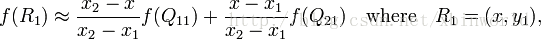
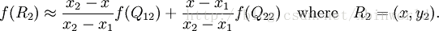
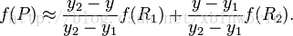


**SVM LDA**
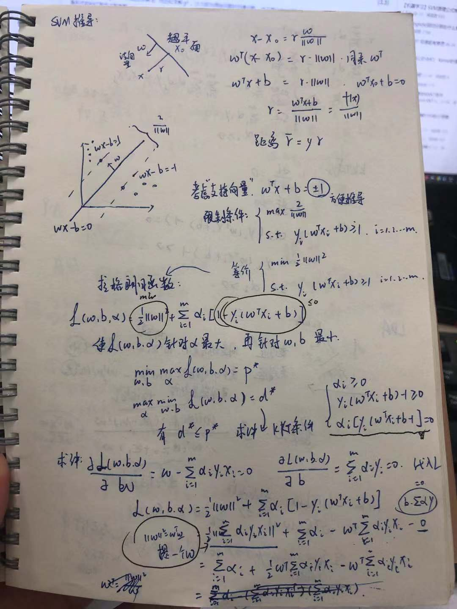
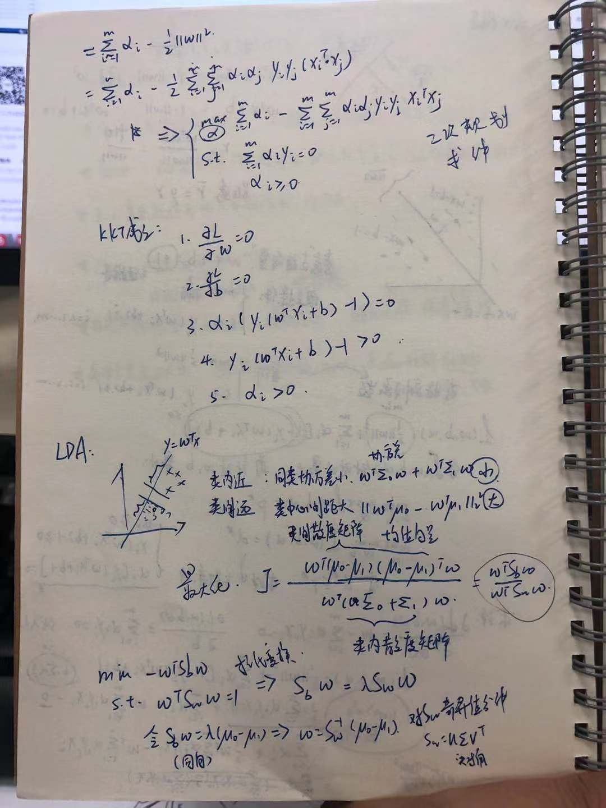

**其他点**
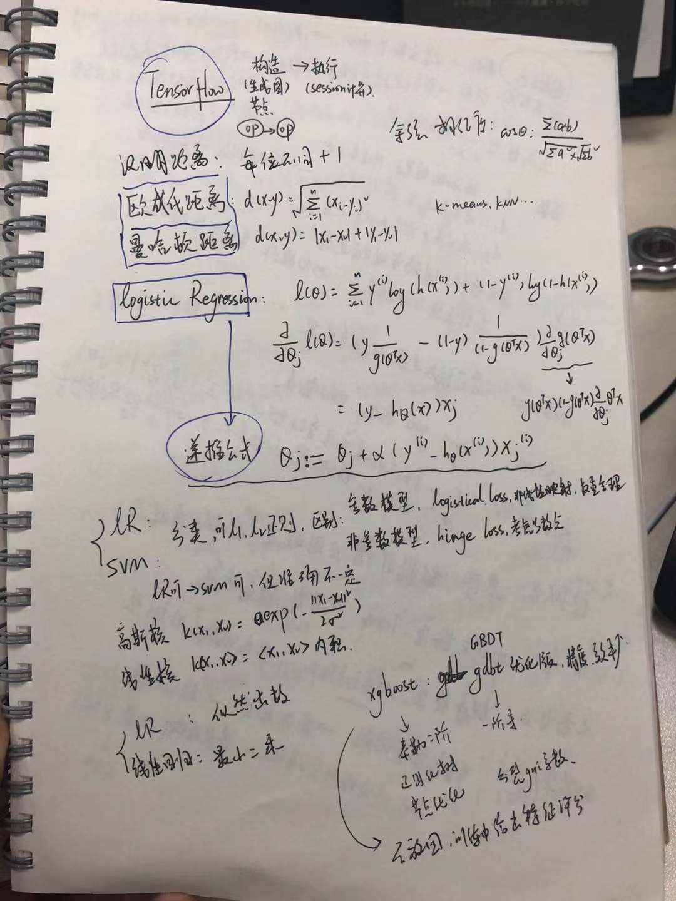
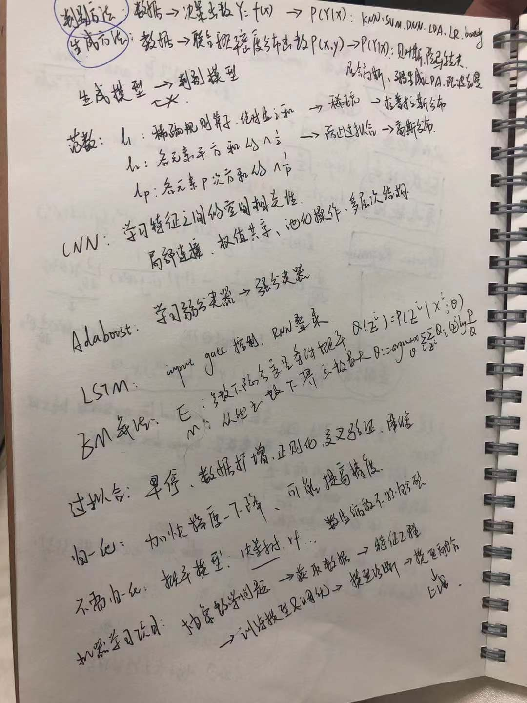
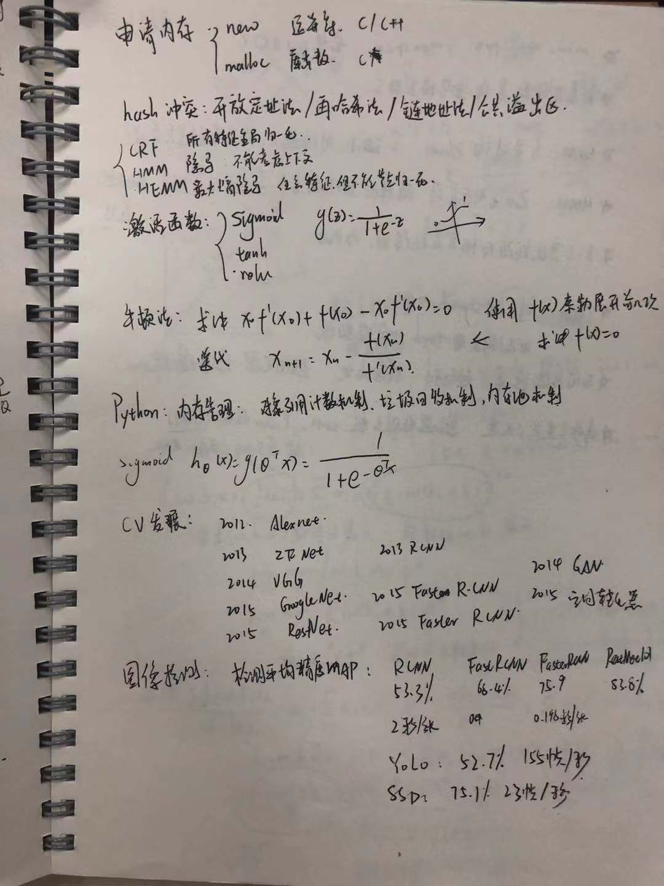
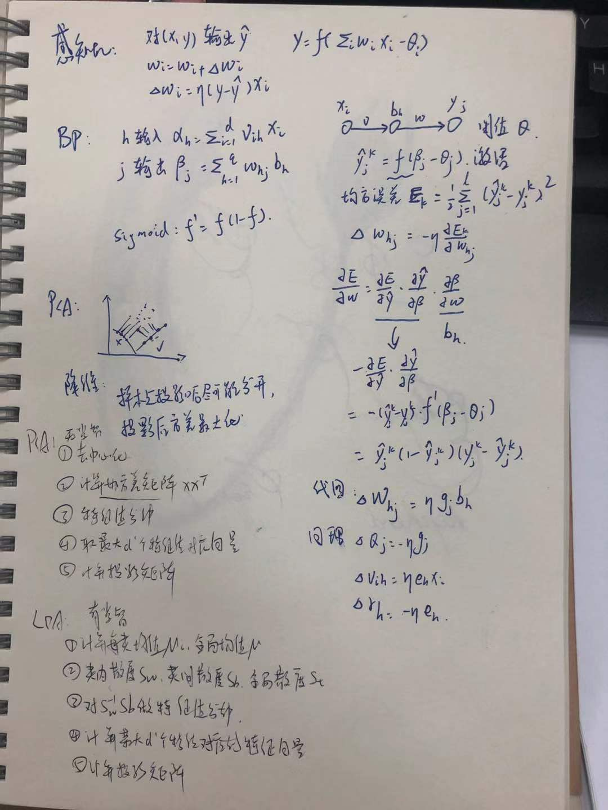
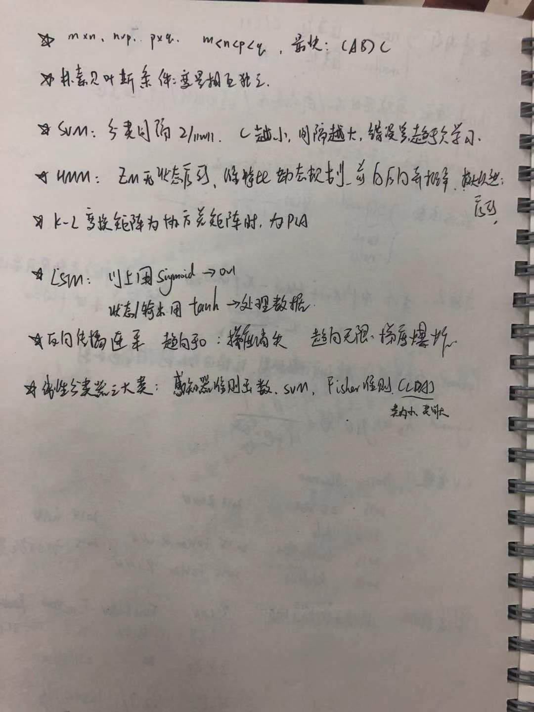

    
    