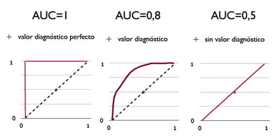

<script type="text/javascript" src="http://cdn.mathjax.org/mathjax/latest/MathJax.js?config=default"></script>


**L1 L2 正则化的区别，为什么 L1 产生稀疏矩阵，L2 可以防止过拟合**
    
    ·L0范数是非零元素之和，求解是个NP问题，L1L2是近似解
    ·L1正则化是指权值向量w中各个元素的绝对值之和
    ·L2正则化是指权值向量w中各个元素的平方和然后再求平方根
    过拟合实质上是模型的表示能力“太强”，也就是模型容量太大。
    通过加上正则来降低模型的容量或者表示能力，
    L1约束模型参数分布比较稀疏，L2约束参数分布均匀一点，减少系数个数。
    简单点说，l1限制了模型容量，所以可以减少过拟合;
    l2相当于认为参数服从高斯分布，l1是拉普拉斯分布。
    L1,L2范式来自于对数据的先验知识.如果你认为,你现有的数据来自于高斯分布,
    那么就应该在代价函数中加入数据先验P(x),一般由于推导和计算方便会加入对数似然,
    也就是log(P(x)),然后再去优化,这样最终的结果是,由于你的模型参数考虑了数据先验,
    模型效果当然就更好.哦对了,如果你去看看高斯分布的概率密度函数P(x),
    你会发现取对数后的log(P(x))就剩下一个平方项了,这就是L2范式的由来--高斯先验.
    同样,如果你认为你的数据是稀疏的,不妨就认为它来自某种laplace分布.
    laplace分布是尖尖的分布,服从laplace分布的数据就是稀疏的了
    (只有很小的概率有值,大部分概率值都很小或为0).

**梯度消失和梯度爆炸**

    两种情况下梯度消失经常出现，一是在深层网络中，二是采用了不合适的损失函数，比如sigmoid。梯度爆炸一般出现在深层网络和权值初始化值太大

**LR 的数学原理**
    
    逻辑回归也被称为广义线性回归模型，它与线性回归模型的形式基本上相同，都具有 ax+b，其中a和b是待求参数，其区别在于他们的因变量不同，多重线性回归直接将ax+b作为因变量，即y = ax+b，而logistic回归则通过函数S将ax+b对应到一个隐状态p，p = S(ax+b)，然后根据p与1-p的大小决定因变量的值。这里的函数S就是Sigmoid函数


    逻辑回归一般使用交叉熵作为代价函数。
    $$L = - \frac{1}{n}\sum\limits_{i = 1}^n {[{y_i}\log ({{\hat y}_i}) + (1 - {y_i})\log (1 - {{\hat y}_i})]}$$
    梯度下降法：
    $$\begin{equation}
    \nabla L(w) = \frac{\partial L}{\partial w} = \frac{1}{N}\sum_{i=1}^{N}(h(x_i) - y_i)x_i \\
    w = w - \alpha\cdot \nabla L(w)
    \end{equation}$$

**算法评估指标 ROC曲线，AUC值**

    (1) 真阳性(True Positive，TP)：检测T，且实际T；正确肯定的匹配数目；
    (2) 假阳性(False Positive，FP)：检测T，但实际F；误报，给出的匹配是不正确的；
    (3) 真阴性(True Negative，TN)：检测F，且实际F；正确拒绝的非匹配数目；
    (4) 假阴性(False Negative，FN)：检测F，但实际T；漏报，没有正确找到的匹配的数目。
    ROC曲线：接收者操作特征曲线（receiver operating characteristic curve），是反映敏感性和特异性连续变量的综合指标，roc曲线上每个点反映着对同一信号刺激的感受性。
    横坐标：1-Specificity，伪正类率(False positive rate， FPR)，预测为正但实际为负的样本占所有负例样本的比例,FPR越大，预测正类中实际负类越多。；
    纵坐标：Sensitivity，真正类率(True positive rate， TPR)，预测为正且实际为正的样本占所有正例样本的比例,TPR越大，预测正类中实际正类越多。
    理想目标：TPR=1，FPR=0，故ROC曲线越靠拢(0,1)点，越偏离45度对角线越好，Sensitivity、Specificity越大效果越好。

    
    AUC (Area Under Curve) 为ROC曲线下的面积，取值范围一般在0.5和1之间。使用AUC值作为评价标准是因为很多时候ROC曲线并不能清晰的说明哪个分类器的效果更好，而作为一个数值，对应AUC更大的分类器效果更好。
    AUC值是一个概率值，当你随机挑选一个正样本以及一个负样本，当前的分类算法根据计算得到的Score值将这个正样本排在负样本前面的概率就是AUC值。
    从AUC判断分类器（预测模型）优劣的标准：
    AUC = 1，是完美分类器，采用这个预测模型时，存在至少一个阈值能得出完美预测。绝大多数预测的场合，不存在完美分类器。
    0.5 < AUC < 1，优于随机猜测。这个分类器（模型）妥善设定阈值的话，能有预测价值。
    AUC = 0.5，跟随机猜测一样（例：丢铜板），模型没有预测价值。
    AUC < 0.5，比随机猜测还差；但只要总是反预测而行，就优于随机猜测。
    三种AUC值示例：



**bagging 和 boosting 区别**

    1、Bagging (bootstrap aggregating)    
    A）从原始样本集中抽取训练集。每轮从原始样本集中使用Bootstraping的方法抽取n个训练样本（在训练集中，有些样本可能被多次抽取到，而有些样本可能一次都没有被抽中）。共进行k轮抽取，得到k个训练集。（k个训练集之间是相互独立的）
    B）每次使用一个训练集得到一个模型，k个训练集共得到k个模型。（注：这里并没有具体的分类算法或回归方法，我们可以根据具体问题采用不同的分类或回归方法，如决策树、感知器等）
    C）对分类问题：将上步得到的k个模型采用投票的方式得到分类结果；对回归问题，计算上述模型的均值作为最后的结果。（所有模型的重要性相同）

    2、Boosting
    其主要思想是将弱分类器组装成一个强分类器。在PAC（概率近似正确）学习框架下，则一定可以将弱分类器组装成一个强分类器。
    关于Boosting的两个核心问题：
    1）在每一轮如何改变训练数据的权值或概率分布？
    通过提高那些在前一轮被弱分类器分错样例的权值，减小前一轮分对样例的权值，来使得分类器对误分的数据有较好的效果。
    2）通过什么方式来组合弱分类器？
    通过加法模型将弱分类器进行线性组合，比如AdaBoost通过加权多数表决的方式，即增大错误率小的分类器的权值，同时减小错误率较大的分类器的权值。
    而提升树通过拟合残差的方式逐步减小残差，将每一步生成的模型叠加得到最终模型。
    二者之间的区别
    1）样本选择上：
    Bagging：训练集是在原始集中有放回选取的，从原始集中选出的各轮训练集之间是独立的。
    Boosting：每一轮的训练集不变，只是训练集中每个样例在分类器中的权重发生变化。而权值是根据上一轮的分类结果进行调整。
    2）样例权重：
    Bagging：使用均匀取样，每个样例的权重相等
    Boosting：根据错误率不断调整样例的权值，错误率越大则权重越大。
    3）预测函数：
    Bagging：所有预测函数的权重相等。
    Boosting：每个弱分类器都有相应的权重，对于分类误差小的分类器会有更大的权重。
    4）并行计算：
    Bagging：各个预测函数可以并行生成
    Boosting：各个预测函数只能顺序生成，因为后一个模型参数需要前一轮模型的结果。
    下面是将决策树与这些算法框架进行结合所得到的新的算法：
    1）Bagging + 决策树 = 随机森林
    2）AdaBoost + 决策树 = 提升树
    3）Gradient Boosting + 决策树 = GBDT

*BN*

    BatchNorm 层对于 input batch 会统计出 mean 和 variance 用于计算 EMA。如果input batch 的 shape 为(B, C, H, W)，统计出的 mean 和 variance 的 shape 为:1 * C * 1 * 1
 

**DenseNet:**
    
    DenseNet提出了一个更激进的密集连接机制：即互相连接所有的层，
    具体来说就是每个层都会接受其前面所有层作为其额外的输入。
    且DenseNet是直接concat来自不同层的特征图，这可以实现特征重用，提升效率，
    这一特点是DenseNet与ResNet最主要的区别。
    
**过拟合**

    判断方法
    过拟合（over-fitting），机器学习模型或者是深度学习模型在训练样本中表现得过于优越，导致在验证数据集以及测试数据集中表现不佳。出现这种现象的主要原因是训练数据中存在噪音或者训练数据太少。
    过拟合问题，根本的原因则是特征维度(或参数)过多，导致拟合的函数完美的经过训练集，但是对新数据的预测结果则较差。

    常见原因
    1）建模样本选取有误，如样本数量太少，选样方法错误，样本标签错误等，导致选取的样本数据不足以代表预定的分类规则；
    2）样本噪音干扰过大，使得机器将部分噪音认为是特征从而扰乱了预设的分类规则；
    3）假设的模型无法合理存在，或者说是假设成立的条件实际并不成立；
    4）参数太多，模型复杂度过高；
    5）对于决策树模型，如果我们对于其生长没有合理的限制，其自由生长有可能使节点只包含单纯的事件数据(event)或非事件数据(no event)，使其虽然可以完美匹配（拟合）训练数据，但是无法适应其他数据集。
    6）对于神经网络模型：
    a)对样本数据可能存在分类决策面不唯一，随着学习的进行,，BP算法使权值可能收敛过于复杂的决策面；
    b)权值学习迭代次数足够多(Overtraining)，拟合了训练数据中的噪声和训练样例中没有代表性的特征。
    
    解决方法
    1）在神经网络模型中，可使用权值衰减的方法，即每次迭代过程中以某个小因子降低每个权值。
    2）提前终止迭代训练：选取合适的停止训练标准，使对机器的训练在合适的程度；
    3）保留验证数据集，对训练成果进行验证；
    4）获取额外数据进行交叉验证；
    5）正则化，即在进行目标函数或代价函数优化时，在目标函数或代价函数。如L1L2正则化，Batch Normalization正则化
    6）Bagging和Boosting  Bagging和Boosting是机器学习中的集成方法，多个模型的组合可以弱化每个模型中的异常点的影响，保留模型之间的通性，弱化单个模型的特性。
    7）增加噪声 这也是深度学习中的一种避免过拟合的方法（没办法，深度学习模型太复杂，容易过拟合），添加噪声的途径有很多，可以在输入数据上添加，增大数据的多样性，可以在权值上添加噪声，这种方法类似于L2正则化。
    8）权值共享  权值共享最常见的就是在卷积神经网络中，权值共享的目的旨在减小模型中的参数，同时还能较少计算量。在循环神经网络中也用到了权值共享
    
**ResNet**
    
    ResNet50:49个卷积层（3+4+6+3）*3+1=49    


**卷积计算量**
    
    给定一个卷积层 C in * C out * H k * W k  (H k * W k 为 kernel shape), output feature  map shape 为 H * W，
    其 FLOPs 为2 * (C in * H k * W k + 1) * C out * H * W，参数量为 (C in * H k * W k + 1) * C out (1 乘累加 = 2 FLOPs)    


**卷积之后的尺寸**
    
    （W - F + 2P）/ S + 1
    其中，W是输入尺寸，F是卷积核大小，P是填充尺寸，S是步长

**IOU计算**
```python

def compute_iou(rec1, rec2):
    """
    计算两个矩形框的交并比。
    :param rec1: (x0,y0,x1,y1)      (x0,y0)代表矩形左上的顶点，（x1,y1）代表矩形右下的顶点。下同。
    :param rec2: (x0,y0,x1,y1)
    :return: 交并比IOU.
    """
    left_column_max  = max(rec1[0],rec2[0])
    right_column_min = min(rec1[2],rec2[2])
    up_row_max       = max(rec1[1],rec2[1])
    down_row_min     = min(rec1[3],rec2[3])
    #两矩形无相交区域的情况
    if left_column_max>=right_column_min or down_row_min<=up_row_max:
        return 0
    # 两矩形有相交区域的情况
    else:
        S1 = (rec1[2]-rec1[0])*(rec1[3]-rec1[1])
        S2 = (rec2[2]-rec2[0])*(rec2[3]-rec2[1])
        S_cross = (down_row_min-up_row_max)*(right_column_min-left_column_max)
        return S_cross/(S1+S2-S_cross)

```


**SVM LDA**


**其他点**


    
    