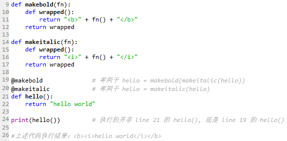
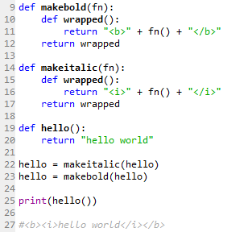
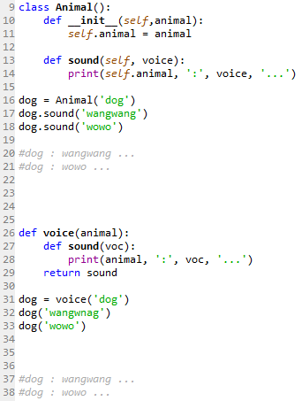
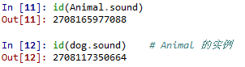
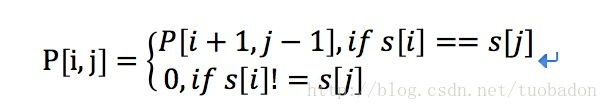

#找工作的一些算法题
主要来自网络（牛客剑指offer和CSDN）

**装饰器和闭包**

事实上，装饰器就是一种的闭包的应用，只不过其传递的是函数：



@makeitalic 装饰器将函数 hello 传递给函数 makeitalic，函数 makeitalic 执行完毕后返回被包装后的 hello 函数，而这个过程其实就是通过闭包实现的。@makebold 也是如此，只不过其传递的是 @makeitalic 装饰过的 hello 函数，因此最后的执行结果 <b> 在 <i> 外层，这个功能如果不用装饰器，其实就是显式的使用闭包：



闭包的最大特点是可以将父函数的变量与内部函数绑定，并返回绑定变量后的函数（也即闭包），此时即便生成闭包的环境（父函数）已经释放，闭包仍然存在，这个过程很像类（父函数）生成实例（闭包），不同的是父函数只在调用时执行，执行完毕后其环境就会释放，而类则在文件执行时创建，一般程序执行完毕后作用域才释放，因此对一些需要重用的功能且不足以定义为类的行为，使用闭包会比使用类占用更少的资源，且更轻巧灵活，现举一例：假设我们仅仅想打印出各类动物的叫声，分别以类和闭包来实现：



可以看到输出结果是完全一样的，但显然类的实现相对繁琐，且这里只是想输出一下动物的叫声，定义一个 Animal 类未免小题大做，而且 voice 函数在执行完毕后，其作用域就已经释放，但 Animal 类及其实例 dog 的相应属性却一直贮存在内存中：


而这种占用对于实现该功能后，则是没有必要的。这里闭包引用的资源不回收，很类似C++的共享指针的一种应用场景。

除此之外，闭包还有很多其他功能，比如用于封装等，另外，闭包有效的减少了函数参数的数目，这对并行计算非常有价值，比如可以让每台电脑负责一个函数，然后串起来，实现流水化的作业等。

**快排**
```python
# -*- coding:utf-8 -*-
class Solution:
    def GetLeastNumbers_Solution(self, tinput):
        # write code here
        def quick_sort(lst):
            if not lst:
                return []
            pivot = lst[0]
            left = quick_sort([x for x in lst[1: ] if x < pivot])
            right = quick_sort([x for x in lst[1: ] if x >= pivot])
            return left + [pivot] + right
        tinput = quick_sort(tinput)
        return tinput[: ]
```
**归并排序**

    分治策略


```python
# -*- coding:utf-8 -*-
class Solution:
    def GetLeastNumbers_Solution(self, tinput):
        # write code here
        def merge_sort(lst):
            if len(lst) <= 1:
                return lst
            mid = len(lst) // 2
            left = merge_sort(lst[: mid])
            right = merge_sort(lst[mid:])
            return merge(left, right)
        def merge(left, right):
            l, r, res = 0, 0, []
            while l < len(left) and r < len(right):
                if left[l] <= right[r]:
                    res.append(left[l])
                    l += 1
                else:
                    res.append(right[r])
                    r += 1
            res += left[l:]
            res += right[r:]
        tinput = merge_sort(tinput)
        return tinput[:]
```
**10 万个数中找TopK**
    
    
    快排、堆排序
    https://www.nowcoder.com/questionTerminal/6a296eb82cf844ca8539b57c23e6e9bf?toCommentId=510059
    https://blog.csdn.net/hellojoy/article/details/81740121
**最长回文子串**

    子问题:以i开始,以j结束的子串的最长回文串
    状态：令P[i,j]表示：以i开始,以j结束的子串是否为回文串。
    其值为0,1。P[i,j]==0表示子串s[i:j]不是回文串，P[i,j]==1表示子串s[i:j]是回文串。

    
```python
'''
动态规划解法：
dp数组：维护子串状态
step 1:初始化dp数组,完成长度小于3的子串状态判断
step 2:i为子串长度，j为子串起始地址，r为子串结束地址.
第二步逐步得到长度为i的子串状态，利用状态转移方程完成这一判断。
step 3:根据第二步得到的最长子串长度和起始位置，得到最终结果
'''
class Solution(object):
    def longestPalindrome(self, s):
        lens=len(s)
        maxlen=0
        start=0
        dp=[[0]*lens]*lens
        
        #step 1
        for i in range(lens):
            dp[i][i]=True
            if i<lens-1 and s[i]==s[i+1]:
                dp[i][i+1]=1
                start=i
                maxlen=2
 
        #step 2
        for i in range(3,lens+1):
            for j in range(0,lens-i+1):
                r=j+i-1
                if dp[j+1][r-1] and s[j]==s[r]:
                    dp[j][r]=1
                    maxlen=i
                    start=j
        #step 3
        if maxlen>=2:
            return s[start:start+maxlen]
        return None
```
**反序字符串**
    
    堆栈
    
**链表反转**
```python
class Solution:
    # 返回ListNode
    def ReverseList(self, pHead):
        # write code here
        if pHead==None or pHead.next==None:
            return pHead
        pre = None
        cur = pHead
        while cur!=None:
            tmp = cur.next
            cur.next = pre
            pre = cur
            cur = tmp
        return pre
```
**增序链表合并**
```python
class ListNode():
    def __init__(self,val):
        self.val = val
        self.next = None
class Solution:
    # 返回合并后列表
    def Merge(self, pHead1, pHead2):
        # write code here
        #初始化
        tmp = ListNode(0)
        pHead = tmp
        while pHead1 and pHead2:
            if pHead1.val < pHead2.val:
                tmp.next = pHead1
                pHead1 = pHead1.next
            else:
                tmp.next = pHead2
                pHead2 = pHead2.next
            tmp = tmp.next
        if not pHead1:
            tmp.next = pHead2
        if not pHead2:
            tmp.next = pHead1
        return pHead.next
```
**前中后序遍历**
    
    前序遍历：根结点 ---> 左子树 ---> 右子树
    中序遍历：左子树---> 根结点 ---> 右子树
    后序遍历：左子树 ---> 右子树 ---> 根结点
    前中遍历得到树：
```python
class TreeNode():
    def __init__(self,val):
        self.val = val
        self.left = None
        self.right = None
def reConstructBinaryTree(self, pre, tin):
    if not pre or not tin:
        return None
    root = TreeNode(pre.pop(0))
    index = tin.index(root.val)
    root.left = self.reConstructBinaryTree(pre, tin[:index])
    root.right = self.reConstructBinaryTree(pre, tin[index + 1:])
    return root
``` 
    验证后序遍历：根据最后一个数把序列分成左右两个部分，如果左部分全部小于该数，右部分全部大于该数。则证明是后序遍历。

**找链表中倒数k个数：**
```python
class Solution:
    def FindKthToTail(self, head, k):
        # write code here
        if head==None or k<=0:
            return None
        #设置两个指针，p2指针先走（k-1）步，然后再一起走，当p2为最后一个时，p1就为倒数第k个 数
        p2=head
        p1=head
        #p2先走，走k-1步，如果k大于链表长度则返回 空，否则的话继续走
        while k>1:
            if p2.next!=None:
                p2=p2.next
                k-=1
            else:
                return None
    #两个指针一起 走，一直到p2为最后一个,p1即为所求
        while p2.next!=None:
            p1=p1.next
            p2=p2.next
        return p1
```
**输入两棵二叉树A，B，判断B是不是A的子结构。**

```python
class Solution:
    def HasSubtree(self, pRoot1, pRoot2):
         
        def convert(p):
            if p:
                return str(p.val) +  convert(p.left) + convert(p.right)
            else:
                return ""
        return convert(pRoot2) in convert(pRoot1) if pRoot2 else False
```


**概率题**

**一、随机数发生器**
这类题目在解决的过程中要注意：最后产生的随机数中，可以存在没有用的随机数，
但必须保证所有要用到的随机数产生的概率必须是相同的。

**已知一随机发生器，产生 00 的概率是 pp，产生 11 的概率是 1-p1−p，**
现在要你构造一个发生器，使得它产生 00 和 11 的概率均为 1/21/2。
    
    求解： 让该随机数生成器生成两个数，那么序列是 0000，0101，1010，1111
    概率分别为 pppp，p(1-p)p(1−p)，(1-p)p(1−p)p，(1-p)(1-p)(1−p)(1−p)。
    我们发现产生序列 0101 以及 1010 的概率是相等的，那么我们把 0101 看作为 00，
    把 1010 看作是 11，则他们产生的概论均为 p(1-p)p(1−p)，其他情况舍弃不用，
    这样就得到了 00 和 11 均等生成的随机器了。

**已知有个 rand7() 的函数，返回 11 到 77 随机自然数，
怎样利用这个 rand7() 构造 rand10()，随机产生出 11 到 1010 的自然数。**
    
    求解： 如果能够得到一组等概率的数，不管是什么数，只要等概率而且个数大于 1010，
    那么问题就可以解决了。事实上，解决方案是有无数种的，只要保证产生的结果映射到 11 到 1010 的自然数后，
    是等概率的独立事件即可。例如，(rand7() - 1) * 7 + rand7()，可以等概率的生成 11 到 4949，
    那么，只要把 11-4911−49 去掉就可以了。不过这样的做法在实际使用过程中毕竟低效。
    因此可以去掉 41-4941−49，然后在把 1-401−40 映射到 1-101−10 （每四个数映射为 11 个数），
    那么问题也就解决了。

**二、掷筛子的期望**
**商家发明一种扔筛子游戏，顾客扔到多少点就得到多少钱，但扔筛子之前顾客需要付一定数量的钱 xx，
假设商家和顾客都足够聪明：**

顾客付一次钱可以扔一次的情况下，顾客能接受的最大 xx 是多少？
现在规则改为顾客付一次钱可以扔两次，顾客扔了第一次之后可以选择是否继续扔第二次，
如果扔了第二次则以第二次的结果为准，如果没有扔第二次就以第一次的结果为准，
这时顾客能接受的最大 xx 为多少？
    
    求解： 题目本质上是问掷一次筛子的期望以及掷两次筛子的期望。
    1/6 (1 + 2 + 3 + 4 + 5 + 6) = 3.51/6(1+2+3+4+5+6)=3.5
    考虑顾客什么情况下会扔第二次，就是扔第二次得到钱变多的概率相对较大的时候，
    那么当顾客第一次扔到 11，22，33 的时候他会选择继续扔第二次，
    则这时候期望变为 1/6 (4+5+6) + 1/2 (1/6 (1+2+3+4+5+6)) =
    4.251/6(4+5+6)+1/2(1/6(1+2+3+4+5+6))=4.25

**剑指offer：**
**在一个二维数组中（每个一维数组的长度相同），每一行都按照从左到右递增的顺序排序，
每一列都按照从上到下递增的顺序排序。请完成一个函数，输入这样的一个二维数组和一个整数，
判断数组中是否含有该整数。**
    
    思路：从左下角元素往上查找，右边元素是比这个元素大，上边是的元素比这个元素小。
    于是，target比这个元素小就往上找，比这个元素大就往右找。如果出了边界，
    则说明二维数组中不存在target元素。(为什么不从左上角开始搜寻，左上角向右和向下都是递增，那么对于一个点，
    对于向右和向下会产生一个岔路；如果我们选择从左下脚开始搜寻的话，如果大于就向右，如果小于就向下)。

**输入一个链表，按链表值从尾到头的顺序返回一个ArrayList。**
    
    思路：递归
    
**输入一个矩阵，按照从外向里以顺时针的顺序依次打印出每一个数字**

    善于使用pop，默认是返回弹出的队尾元素

```python
class Solution:
 
    def printMatrix(self, matrix):
        res = []
        while matrix:
            res += matrix.pop(0)
            if matrix and matrix[0]:
                for row in matrix:
                    res.append(row.pop())
            if matrix:
                res += matrix.pop()[::-1]
            if matrix and matrix[0]:
                for row in matrix[::-1]:
                    res.append(row.pop(0))
        return res
```
**定义栈的数据结构，请在该类型中实现一个能够得到栈中所含最小元素的min函数（时间复杂度应为O（1））。**
    
    思路：利用一个辅助栈来存放最小值
    栈  3，4，2，5，1
    辅助栈 3，3，2，2，1
    每入栈一次，就与辅助栈顶比较大小，如果小就入栈，如果大就入栈当前的辅助栈顶
    当出栈时，辅助栈也要出栈
    这种做法可以保证辅助栈顶一定都当前栈的最小值
```python
# -*- coding:utf-8 -*-
class Solution:
    def __init__(self):
        self.stack = []
        self.assist = []
         
    def push(self, node):
        min = self.min()
        if not min or node < min:
            self.assist.append(node)
        else:
            self.assist.append(min)
        self.stack.append(node)
         
    def pop(self):
        if self.stack:
            self.assist.pop()
            return self.stack.pop()
     
    def top(self):
        # write code here
        if self.stack:
            return self.stack[-1]
         
    def min(self):
        # write code here
        if self.assist:
            return self.assist[-1]
```
**二叉搜索树**

    中序遍历是有序队列
    左子树小于根 右子树大于根
**数组中有一个数字出现的次数超过数组长度的一半，请找出这个数字。**

    假设有这个数字，那么它的数量一定比其它所有数字之和还要多，按照这个思路得出num，然后验证
 ```python
def MoreThanHalfNum_Solution(numbers):
    # write code here
    if not numbers:
        return 0
    num = numbers[0]
    count = 1
    for i in range(1, len(numbers)):
        if numbers[i] == num:
            count += 1
        else:
            count -= 1
        if count == 0:
            num = numbers[i]
            count = 1
    count = 0
    for i in numbers:
        if i == num:
            count += 1
    return num if count > len(numbers) / 2.0 else 0
```
**几个子数组组成的最小数字** 
    
    自定义一个比较大小的函数，比较两个字符串s1, s2大小的时候，先将它们拼接起来，比较s1+s2,和s2+s1那个大，如果s1+s2大，那说明s2应该放前面，所以按这个规则，s2就应该排在s1前面。   
```python
class Solution:
    def PrintMinNumber(self, numbers):
        # write code here
        if not numbers: return ""
        numbers = list(map(str, numbers))
        numbers.sort(cmp=lambda x, y: cmp(x + y, y + x))
        return "".join(numbers).lstrip('0') or'0'
```
**输入两个链表，找出它们的第一个公共结点。**

    对单链表而言，只要有一个公共节点，就代表val和next全部相等，也就必然两个链表结合是"Y"字形，而不是"X"形；所以以栈的思路做这道题。
    stack1和stack2一起出栈，一直到栈顶不相等为止
```python
class Solution:
    def __init__(self):
        self.stack1=[]
        self.stack2=[]
    def FindFirstCommonNode(self, pHead1, pHead2):
        # write code here
        ln1=ListNode(0)
        if pHead1==None or pHead2==None:
            return None
        while pHead1:
            self.stack1.append(pHead1)
            pHead1=pHead1.next
        while pHead2:
            self.stack2.append(pHead2)
            pHead2=pHead2.next
        while self.stack1 and self.stack2 and self.stack1[-1]==self.stack2[-1]:
            ln1.next=self.stack1.pop()
            self.stack2.pop()
        return ln1.next
```
**树的深度遍历**
```python
class Solution:
    def TreeDepth(self, pRoot):
        # write code here
        # 使用层次遍历
        # 当树为空直接返回0
        if pRoot is None:
            return 0
        # 方法2：使用递归
        # 如果该树只有一个结点，它的深度为1.如果根节点只有左子树没有右子树，
        # 那么树的深度为左子树的深度加1；同样，如果只有右子树没有左子树，
        # 那么树的深度为右子树的深度加1。如果既有左子树也有右子树，
        # 那该树的深度就是左子树和右子树的最大值加1.
        count = max(self.TreeDepth(pRoot.left), self.TreeDepth(pRoot.right)) + 1
        return count
```
**平衡二叉树**
    
    平衡二叉树（Balanced Binary Tree），具有以下性质：它是一棵空树或它的左右两个子树的高度差的绝对值不超过1，并且左右两个子树都是一棵平衡二叉树。
```python
class Solution:
    res = True
    def IsBalanced_Solution(self, pRoot):
        # write code here
        self.helper(pRoot)
        return self.res
         
    def helper(self,root):
        if not root:
            return 0
        if not self.res : return 1
        left = 1 + self.helper(root.left)
        right = 1 + self.helper(root.right)
        if abs(left-right)>1:
            self.res = False
        return max(left,right)
```    
**输入一个递增排序的数组和一个数字S，在数组中查找两个数，使得他们的和正好是S，如果有多对数字的和等于S，输出两个数的乘积最小的。**

    数列满足递增，设两个头尾两个指针i和j，
    若ai + aj == sum，就是答案（相差越远乘积越小）
    若ai + aj > sum，aj肯定不是答案之一（前面已得出 i 前面的数已是不可能），j -= 1
    若ai + aj < sum，ai肯定不是答案之一（前面已得出 j 后面的数已是不可能），i += 1
    O(n)
```python
class Solution:
    def FindNumbersWithSum(self, array, tsum):
        for i in array:
            if tsum-i in array:
                if tsum-i==i:
                    if array.count(i)>1:
                        return [i,i]
                else:
                    return [i,tsum-i]
        return []
```
**join函数**

    join()函数
    语法：  'sep'.join(seq)
    参数说明
    sep：分隔符。可以为空
    seq：要连接的元素序列、字符串、元组、字典
    上面的语法即：以sep作为分隔符，将seq所有的元素合并成一个新的字符串
    返回值：返回一个以分隔符sep连接各个元素后生成的字符串

**给定一个数组A[0,1,...,n-1],请构建一个数组B[0,1,...,n-1],其中B中的元素B[i]=A[0]*A[1]*...*A[i-1]*A[i+1]*...*A[n-1]。不能使用除法。**

    解释下代码，设有数组大小为5。
    对于第一个for循环
    第一步：b[0] = 1;
    第二步：b[1] = b[0] * a[0] = a[0]
    第三步：b[2] = b[1] * a[1] = a[0] * a[1];
    第四步：b[3] = b[2] * a[2] = a[0] * a[1] * a[2];
    第五步：b[4] = b[3] * a[3] = a[0] * a[1] * a[2] * a[3];
    然后对于第二个for循环
    第一步
    temp *= a[4] = a[4]; 
    b[3] = b[3] * temp = a[0] * a[1] * a[2] * a[4];
    第二步
    temp *= a[3] = a[4] * a[3];
    b[2] = b[2] * temp = a[0] * a[1] * a[4] * a[3];
    第三步
    temp *= a[2] = a[4] * a[3] * a[2]; 
    b[1] = b[1] * temp = a[0] * a[4] * a[3] * a[2];
    第四步
    temp *= a[1] = a[4] * a[3] * a[2] * a[1]; 
    b[0] = b[0] * temp = a[4] * a[3] * a[2] * a[1];
    由此可以看出从b[4]到b[0]均已经得到正确计算。
```python
class Solution:
    def multiply(self, A):
        # write code here
        B = []
        for i in range(len(A)):
            temp = A[i]
            b= 1
            for j in range(len(A)):
                A[i] = 1
                b*=A[j]
            B.append(b)
            A[i] = temp
        return B
```
**有环链表**

    快慢指针，快指针每次走两步，慢指针每次走一步，有环总会相遇
```python
class Solution:
    def EntryNodeOfLoop(self, pHead):
        # write code here
        slow,fast=pHead,pHead
        while fast and fast.next:
            slow=slow.next
            fast=fast.next.next
            if slow==fast:
                slow2=pHead
                while slow!=slow2:
                    slow=slow.next
                    slow2=slow2.next
                return slow
```

**几个检索的时间复杂度**

    map和multimap都是由RB_tree（红黑树）来实现的，本就合适于查找，复杂度为 O( ln(N) ) 
    UNordered_set ,unordered_map是由hash_table(哈希表)来实现的，时间复杂度为o(1)
    deque的push_back, push_front, pop_back, pop_front操作时间复杂度为O(1)


